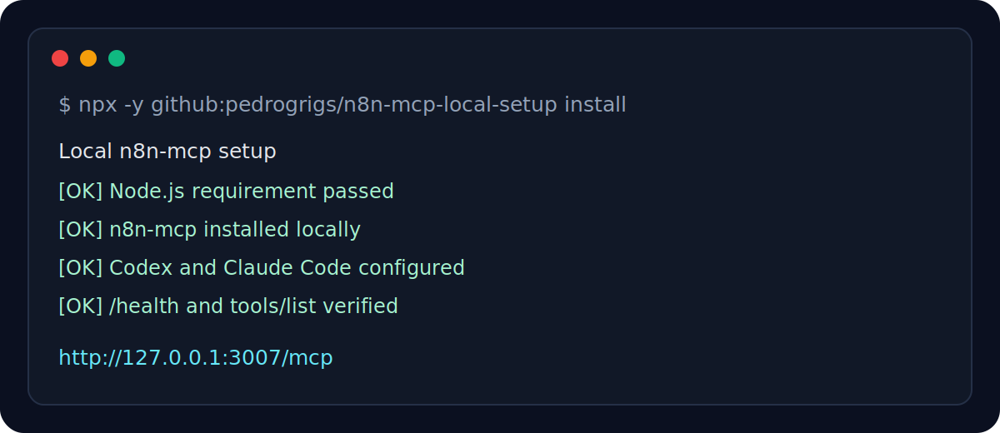

<p align="center">
  
</p>

<h1 align="center">n8n MCP Local Setup</h1>

<p align="center">
  Run the open source <code>n8n-mcp</code> locally and connect your own n8n instance to Codex, Claude Code, or any MCP-compatible AI agent.
</p>

<p align="center">
  <a href="https://github.com/pedrogrigs/n8n-mcp-local-setup/actions/workflows/ci.yml"></a>
  <a href="https://nodejs.org"></a>
  
  
  
</p>

<p align="center">
  <strong>No Docker.</strong> No hosted <code>api.n8n-mcp.com</code>. Your n8n API key stays on your machine.
</p>

## Install

You only need Node.js 18+.

```bash
npx -y github:pedrogrigs/n8n-mcp-local-setup install
```

The installer asks for three things:

| Input | Example |
| --- | --- |
| n8n URL | `https://n8n.example.com` |
| n8n API key | Your n8n user API key |
| Local MCP port | `3007` |

When it finishes, your local MCP endpoint is ready at:

```text
http://127.0.0.1:3007/mcp
```

Restart Codex or Claude Code after install so they reload MCP configuration.

## Why Use This

The hosted n8n MCP endpoint is convenient, but a local setup is better when you want control.

| Hosted bridge | Local bridge with this repo |
| --- | --- |
| API key leaves your machine | API key stays in your user folder |
| Depends on a third-party endpoint | Runs on `127.0.0.1` |
| Manual client setup | Codex and Claude Code configured automatically |
| Remote availability matters | Works while your computer is on |

## What It Configures

The installer automatically:

- Installs the npm package `n8n-mcp`
- Runs the correct HTTP entrypoint for `n8n-mcp`
- Generates a strong local bearer token
- Starts a local MCP server on `127.0.0.1`
- Enables autostart on login
- Configures Codex if installed
- Configures Claude Code if installed
- Replaces old configs pointing to `https://api.n8n-mcp.com`
- Verifies `/health`
- Verifies MCP `tools/list` when possible

## Platform Support

| System | Autostart method |
| --- | --- |
| Windows | User Scheduled Task |
| macOS | User LaunchAgent |
| Linux | systemd user service |
| Linux fallback | XDG autostart entry |

## Common Commands

Check status:

```bash
npx -y github:pedrogrigs/n8n-mcp-local-setup status
```

Run diagnostics:

```bash
npx -y github:pedrogrigs/n8n-mcp-local-setup doctor
```

Restart the local server:

```bash
npx -y github:pedrogrigs/n8n-mcp-local-setup restart
```

Print generic MCP client snippets:

```bash
npx -y github:pedrogrigs/n8n-mcp-local-setup snippets
```

## Non-Interactive Install

Use this only in a secure shell session.

macOS/Linux:

```bash
N8N_API_KEY="your-api-key" npx -y github:pedrogrigs/n8n-mcp-local-setup install --yes --url https://your-n8n.example.com --port 3007
```

Windows PowerShell:

```powershell
$env:N8N_API_KEY="your-api-key"
npx -y github:pedrogrigs/n8n-mcp-local-setup install --yes --url https://your-n8n.example.com --port 3007
```

## Where Secrets Are Stored

The installer creates a local runtime folder:

| System | Folder |
| --- | --- |
| Windows | `%USERPROFILE%\.n8n-mcp-local` |
| macOS/Linux | `~/.n8n-mcp-local` |

That folder contains `config.json` with your n8n API key and local MCP token.

Do not publish or share that file.

## Codex

The installer updates `~/.codex/config.toml` and creates a backup before editing.

After installing, restart Codex and run:

```text
/mcp
```

You should see `n8n-mcp` pointing to:

```text
http://127.0.0.1:3007/mcp
```

## Claude Code

If the `claude` command exists, the installer uses Claude Code's MCP CLI to add the local HTTP server at user scope.

After installing, restart Claude Code.

You can verify with:

```bash
claude mcp list
```

## Agent Prompt

If you prefer to let a local coding agent run the setup, send it this prompt:

[prompts/AGENT_INSTALL_PROMPT.md](prompts/AGENT_INSTALL_PROMPT.md)

The prompt includes the important implementation detail learned from real setup: for HTTP mode, run `node_modules/n8n-mcp/dist/mcp/index.js`, not the npm `n8n-mcp` stdio wrapper.

## Generic MCP Config

For clients that support HTTP:

```json
{
  "mcpServers": {
    "n8n-mcp": {
      "type": "http",
      "url": "http://127.0.0.1:3007/mcp",
      "headers": {
        "Authorization": "Bearer <your-local-token>"
      }
    }
  }
}
```

For clients that only support stdio:

```json
{
  "mcpServers": {
    "n8n-mcp": {
      "command": "npx",
      "args": [
        "-y",
        "mcp-remote",
        "http://127.0.0.1:3007/mcp",
        "--header",
        "Authorization: Bearer <your-local-token>"
      ]
    }
  }
}
```

## Troubleshooting

Node.js is missing or too old:

```text
Install Node.js LTS from https://nodejs.org, then run the installer again.
```

Codex or Claude Code does not show the MCP:

```bash
npx -y github:pedrogrigs/n8n-mcp-local-setup doctor
```

Port already in use:

```bash
npx -y github:pedrogrigs/n8n-mcp-local-setup install --port 3010
```

Rotate the local bearer token:

```bash
npx -y github:pedrogrigs/n8n-mcp-local-setup install --rotate-token
```

## Project Status

This project is intentionally small: a focused installer and supervisor for local `n8n-mcp`.

Pull requests are welcome for:

- More MCP clients
- Better Linux desktop fallbacks
- Improved diagnostics
- Safer migration paths from existing configs

See [CONTRIBUTING.md](CONTRIBUTING.md) and [SECURITY.md](SECURITY.md).

## License

MIT

